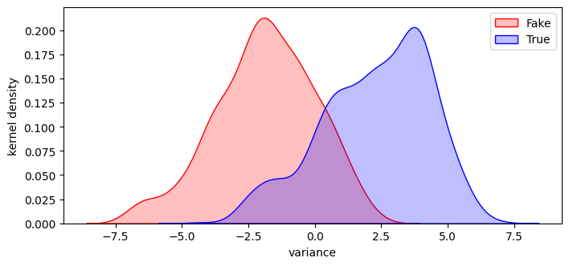
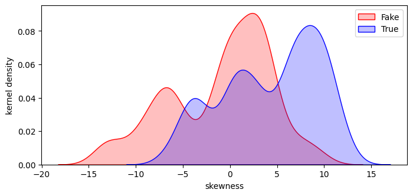
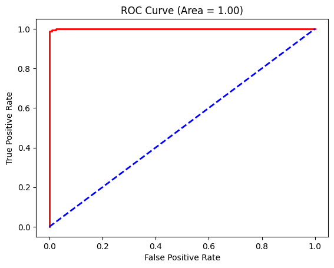
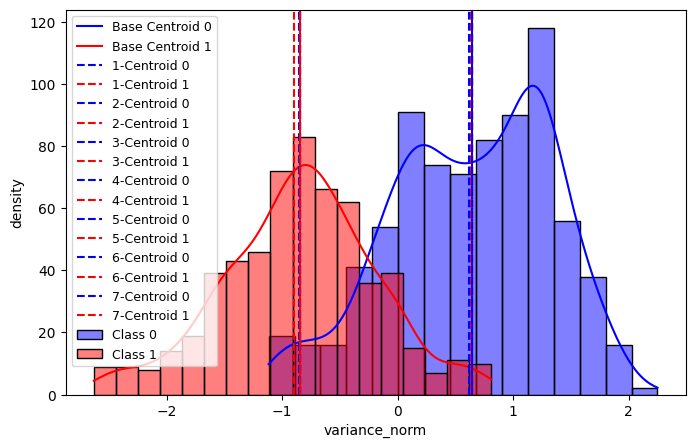
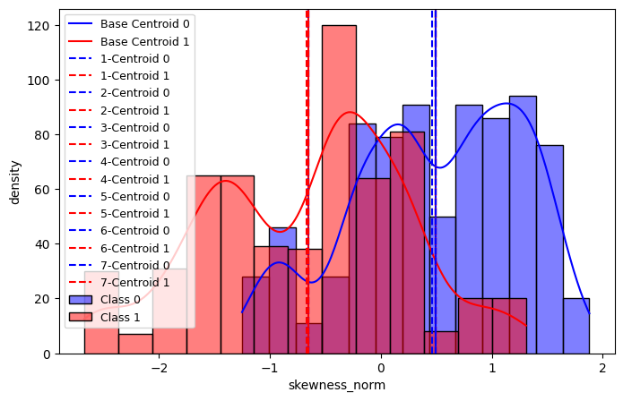
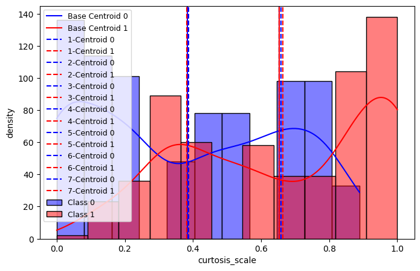
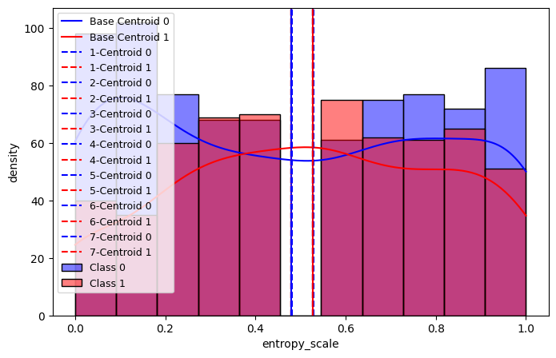

# Banknote Authentication

In this repo, I tackle the banknote verification problem with two approaches, supervised learning and unsupervised learning. Data can be downloaded from [here](https://archive.ics.uci.edu/dataset/267/banknote+authentication).

## Scenario
We are a shop co-owner, and we do not want to lose money getting fake banknotes. However, we do not have enough budget for an advanced instrument that verifies banknotes directly through images, which is probably fast and accurate. The only instrument we can use is an old black-box like machine. This old black box contains an industrial camera taking low-resoulution grey-scale images. The machine will output a rough analysis on the grey-scale images after the camera takes image of a banknote, providing some numerical values about banknote imaging features. Exploiting the numerical values of the banknote grey-scale imaging features, we want to make this old black-box like machine to work as a true-or-fake banknote exminator.

## Supervised learning: [logistic regression](https://github.com/danicychao/banknote_authentication/blob/main/banknote_logistic.ipynb)

- Since the dataset provides the ground truth - we are given a sample of verified banknotes with all the banknotes labeled as true or fake, we are lucky enough to train this black-box like machine as a logistic regression model.

- The Kolmogorov-Smirnov test show that only three out of four features distribute differently between true and fake banknotes. We use these three features, `variance`, `skewness`, and `curtosis`, to train and build the logistic regression model.

- Our trained logistic regression model has **100% recall** and **98% accuracy**. It indicates that with this logistic regression model, we will hardly lose money by receiving fake banknotes.

 

## Unsupervised learning: [K-Means clustering](https://github.com/danicychao/banknote_authentication/blob/main/banknote_clustering.ipynb)

- It is more realistic that we do not know the ground truth - we can afford to get large amount of banknotes verified/labeled as true or fake due to money or time reason.
  
- Instead, we carefully investigate the feature distribution and rescale all the features to ***quantify the similarity among banknotes***. We further use the quantified similarity to build a K-Means clustering mode.

- Our trained K-Means clustering model is stable. If we evaluate our K-Means clustering model with the given labels, our K-Means clustering model achieves **86% accuracy** and **82% recall**. It is not as good as logistic regression, but it is not terrible at all.

 

 
